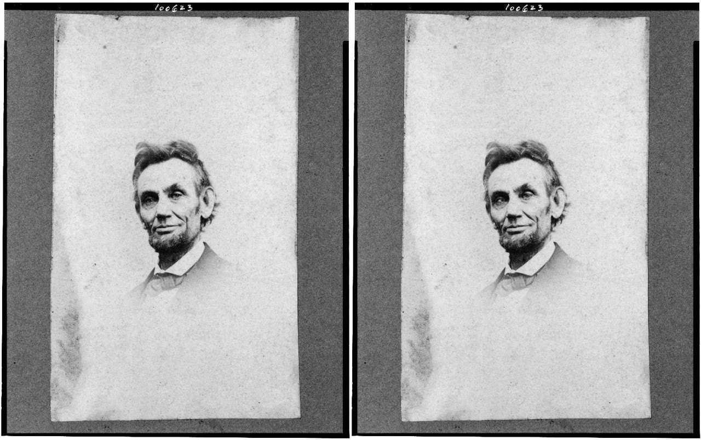
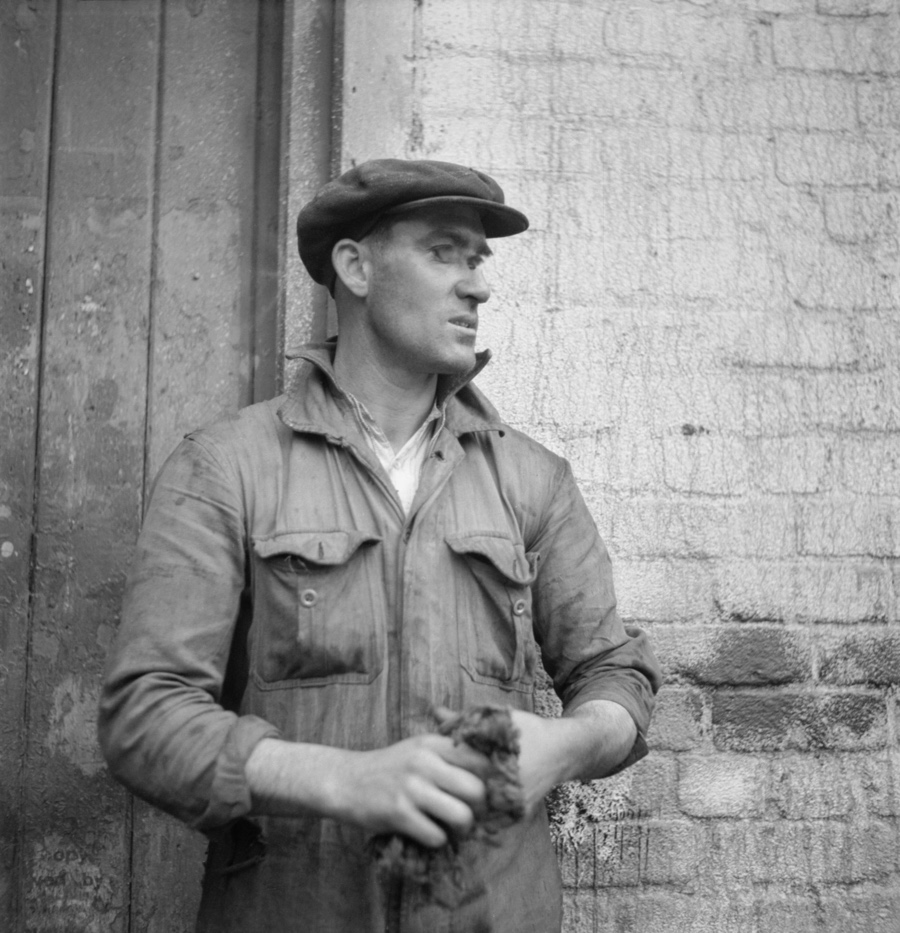
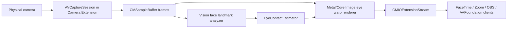

# Gaze Effect



Gaze Effect は、カメラ映像の人物が常にカメラ目線に見えるようにするための macOS 向けカメラエフェクトです。目の輪郭と瞳孔位置を解析し、視線だけを自然にカメラ方向へ寄せることで、オンライン会議、配信、録画の映像に「見られている」感覚を加えます。

The concept is simple: make every captured face look toward the camera, continuously and in real time.

## Concept

ビデオ通話や配信では、画面上の相手や資料を見ているだけで、視線はカメラから外れて見えます。Gaze Effect はこのズレを映像側で補正し、人物が常にカメラを見ているように変換します。

補正は顔全体を作り替えるのではなく、左右の目元だけに限定します。Vision の顔ランドマークから目の輪郭と瞳孔位置を取得し、瞳孔を目の中心方向へ小さく移動させます。これにより、表情、まばたき、頭の向きは保ったまま、視線だけをカメラ方向へ近づけます。

最終的には、Core Media I/O Camera Extension として macOS に仮想カメラを登録し、FaceTime、Zoom、OBS、AVFoundation クライアントなどから通常のカメラとして選択できるようにします。

## Examples

The still-image example below uses a public domain source image and applies the same eye-contact correction concept. The pair shows the original image and the corrected output generated by `GazeEffectImageTool`.

### Cecil Beaton / Tyneside Shipyards

| Original | Corrected |
| --- | --- |
|  |  |

Source: [Wikimedia Commons, public domain](https://commons.wikimedia.org/wiki/File:Cecil_Beaton_Photographs-_Tyneside_Shipyards,_1943_DB143.jpg)

## Video Test

This short test uses a local camera recording, samples it at 12 fps, applies gaze correction frame by frame with the slower `inpaint` fill mode, and encodes the clip at 36 fps for roughly 3x playback. `Assets/test-video-2.mp4` is included as a source clip for reproducible testing; other local source recordings remain ignored.

<video src="Assets/examples/video/gaze-effect-test-2-quad-3x.mp4" controls muted playsinline width="720"></video>

For debugging accuracy, the second test also includes diagnostic renders. The first diagnostic clip paints the detected eye regions white. The second paints the same eye regions white and replaces the corrected pupil/iris target with a red circle. These clips make it easier to see that the current eye-region and pupil localization are still experimental and not yet production accurate.

## Status

This repository currently contains the public project description and the first testable Swift core for estimating eye-contact correction vectors. The production Camera Extension target, Metal/Core Image renderer, signing, and notarized installer are the next implementation steps.

The included installer is a developer-preview package. It installs the command-line validation tool and project documentation, but it does not yet install a virtual camera device.

Accuracy is still a work in progress. The current implementation is useful for verifying the Vision-only pipeline, but eye-region detection, pupil localization, and camera-facing target estimation still need improvement before the effect is reliable across different faces, gaze angles, lighting, and glasses.

## How It Works



## Processing

1. Capture frames from the selected physical camera.
2. Detect eye geometry with either the built-in Vision fallback or MediaPipe Face Landmarker sidecars.
3. Select the primary face by largest bounding box.
4. Estimate the white-of-eye region from each eye contour.
5. Estimate the pupil/iris position from MediaPipe iris landmarks, or with a dark-blob search inside that region when using the offline refinement mode.
6. Remove the original pupil/iris by blending it into surrounding sclera color. The preview app uses a realtime blend; offline frame processing can use an iterative inpaint-like fill.
7. Estimate a per-eye camera-facing target from the eye corners and eyelid bounds, using a small vertical bias to avoid pushing pupils toward the eyelids.
8. Paint the original pupil/iris texture back at the target position with a feathered mask.
9. Do not temporally interpolate pupil positions or correction vectors; eye motion is fast, so each analyzed frame uses the current measurement directly.
10. Emit the processed pixel buffer through `CMIOExtensionStream`.

## Detection Pipelines

Gaze Effect now has two detector paths that feed the same renderer:

- `realtime`: lightweight MediaPipe Face Landmarker / iris landmarks. This avoids Vision's coarse eye contour as the primary source and is designed for the future Camera Extension path. The current Swift preview keeps Vision as a fallback until MediaPipe is integrated natively into the app target.
- `offline`: MediaPipe landmarks plus local dark-blob pupil refinement, then the slower `inpaint` fill mode in `GazeEffectImageTool`. This path is for README/video generation and accuracy debugging, where latency is less important than quality.

Both paths write or consume the same JSON sidecar shape: `leftContour`, `rightContour`, `leftPupil`, `rightPupil`, and `faceBounds`. That keeps the renderer independent of the detector implementation.

## Apple APIs

- [`CMIOExtensionProvider`](https://developer.apple.com/documentation/coremediaio/cmioextensionprovider)
- [`CMIOExtensionDevice`](https://developer.apple.com/documentation/coremediaio/cmioextensiondevice)
- [`CMIOExtensionStream`](https://developer.apple.com/documentation/coremediaio/cmioextensionstream)
- [`VNDetectFaceLandmarksRequest`](https://developer.apple.com/documentation/vision/vndetectfacelandmarksrequest)
- [`VNFaceLandmarks2D.leftPupil`](https://developer.apple.com/documentation/vision/vnfacelandmarks2d/leftpupil)
- [`VNFaceLandmarks2D.rightPupil`](https://developer.apple.com/documentation/vision/vnfacelandmarks2d/rightpupil)

Apple's Camera Extension workflow is documented in [Creating a camera extension with Core Media I/O](https://developer.apple.com/documentation/CoreMediaIO/creating-a-camera-extension-with-core-media-i-o).

## Repository Layout

- `Sources/GazeEffectCore/GazeEffectCore.swift`: frame-independent eye-contact estimation logic.
- `Sources/GazeEffectCoreCheck/main.swift`: geometry and safety checks that run without Xcode.
- `Sources/GazeEffectImageTool/main.swift`: still-image and frame-sequence correction tool used to generate the README examples.
- `scripts/mediapipe-eye-landmarks.py`: MediaPipe Face Landmarker / iris sidecar generator for realtime and offline detector modes.
- `scripts/build-installer.sh`: builds an unsigned developer-preview macOS installer package.

The core package intentionally keeps Vision, AVFoundation, Metal, and Core Media I/O out of the library target. This keeps the correction logic testable and allows the same estimator to run inside a Camera Extension, preview app, or offline renderer.

## Build

```bash
swift run GazeEffectCoreCheck
```

Still image processing:

```bash
swift run GazeEffectImageTool -- \
  --input source.jpg \
  --output corrected.jpg \
  --fill-mode realtime
```

Frame-sequence processing with slower inpaint-like filling:

```bash
swift run GazeEffectImageTool -- \
  --input-dir frames \
  --output-dir corrected-frames \
  --fill-mode inpaint
```

MediaPipe realtime sidecars:

```bash
scripts/mediapipe-eye-landmarks.py \
  --input-dir frames \
  --output-dir landmarks \
  --mode realtime

swift run GazeEffectImageTool -- \
  --input-dir frames \
  --output-dir corrected-frames \
  --landmarks-dir landmarks \
  --fill-mode realtime
```

Offline quality pass:

```bash
scripts/mediapipe-eye-landmarks.py \
  --input-dir frames \
  --output-dir landmarks-offline \
  --mode offline

swift run GazeEffectImageTool -- \
  --input-dir frames \
  --output-dir corrected-frames \
  --landmarks-dir landmarks-offline \
  --fill-mode inpaint
```

Diagnostic frame-sequence rendering:

```bash
swift run GazeEffectImageTool -- \
  --input-dir frames \
  --output-dir white-eyes \
  --render-mode white-eyes

swift run GazeEffectImageTool -- \
  --input-dir frames \
  --output-dir white-eyes-red-pupils \
  --render-mode white-eyes-red-pupils
```

## Build Local App

For a local machine build without an installer:

```bash
./scripts/build-app.sh
open build/GazeEffectPreview.app
```

The preview app opens the camera, runs Vision face landmark analysis, and overlays the estimated eye-contact correction vectors. It is a local preview app, not a CMIO virtual camera device.

Preview modes:

- `Effect`: shifts a small elliptical eye region by the estimated correction vector, moving the dark pupil/iris area toward camera-facing eye contact.
- `Debug`: shows face bounds, eye contours, source pupils, target pupils, and correction vectors without modifying the video image.

## Build Installer

```bash
./scripts/build-installer.sh
```

The generated package is written to:

```text
dist/GazeEffect-DeveloperPreview-0.1.0.pkg
```

Install locally:

```bash
sudo installer -pkg dist/GazeEffect-DeveloperPreview-0.1.0.pkg -target /
gaze-effect-check
```

Installed files:

- `/usr/local/bin/gaze-effect-check`
- `/usr/local/share/gaze-effect/README.md`
- `/usr/local/share/gaze-effect/LICENSE`

## Gatekeeper

The developer-preview installer is unsigned unless it is built with a Developer ID Installer certificate. macOS may show a warning such as:

```text
Apple could not verify "GazeEffect-DeveloperPreview-0.1.0.pkg" is free of malware.
```

For local development only, remove the quarantine attribute and install from Terminal:

```bash
xattr -d com.apple.quarantine dist/GazeEffect-DeveloperPreview-0.1.0.pkg
sudo installer -pkg dist/GazeEffect-DeveloperPreview-0.1.0.pkg -target /
```

For public distribution, build a signed and notarized package:

```bash
DEVELOPER_ID_INSTALLER="Developer ID Installer: Your Name (TEAMID)" \
NOTARY_PROFILE="gaze-effect-notary" \
./scripts/build-installer.sh
```

Create the notary profile once:

```bash
xcrun notarytool store-credentials gaze-effect-notary \
  --apple-id "you@example.com" \
  --team-id "TEAMID"
```

The public distribution package should pass:

```bash
pkgutil --check-signature dist/GazeEffect-DeveloperPreview-0.1.0.pkg
spctl --assess --type install -vv dist/GazeEffect-DeveloperPreview-0.1.0.pkg
```

## Camera Extension Roadmap

1. Create a macOS app target, for example `GazeEffectHost`.
2. Add a Camera Extension target, for example `GazeEffectCameraExtension`.
3. Add this package as a local Swift package dependency and link `GazeEffectCore` to the extension target.
4. In the extension provider source, create one `CMIOExtensionDevice` and one video `CMIOExtensionStream`.
5. In the stream source, start an `AVCaptureSession` and receive physical camera frames.
6. Add a Vision analyzer that converts `VNFaceObservation` landmarks into `FaceLandmarks`.
7. Feed the latest `FaceLandmarks` to `EyeContactEstimator`.
8. Apply a Metal/Core Image ROI warp using `EyeCorrection.delta`.
9. Wrap the processed `CVPixelBuffer` in a `CMSampleBuffer`.
10. Send it through the stream source.

## Visual Design

The first production version should avoid replacing the whole eye. A small local pupil and iris shift is more stable:

- mask: ellipse around each eye with soft feather
- source: original eye texture
- warp: vector field strongest near pupil and fading at the eyelid boundary
- clamp: conservative horizontal/vertical limits around the pupil patch
- fallback: pass-through frame when face/eyes are unstable

For a stronger future version, a 3D eye model or learned gaze-redirection model can be added. The local ROI warp remains the practical MVP for a real-time camera extension.

## License

MIT License.
