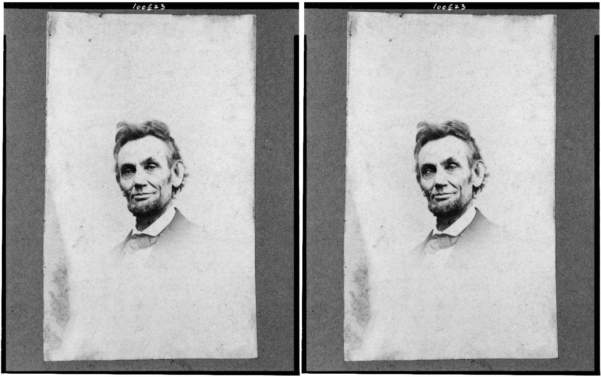

# Gaze Effect



Gaze Effect は、カメラ映像の目元を解析し、視線をカメラ方向へ近づける macOS 向けのローカルエフェクトです。バージョン0.2では、ライブプレビューと動画・静止画の書き出しが同じ解析・合成処理を使います。

通常は全自動で動作します。必要な場合だけ、レンズを見て個人補正を作成できます。頭部姿勢・眼球位置は近似モデルによる推定です。大きな視線変更、強い眼鏡反射、見えていない虹彩・白目の補完には限界があり、実測した視線角度の正解を保証する製品ではありません。

[精度改善の戦略](docs/accuracy-strategy.md) / [初期実装の検証](docs/implementation-status.md) / [正面視線の安定化・最新動画](docs/steady-gaze.md)

[最新の比較動画を再生・ダウンロード](Assets/examples/video/steady-gaze/gaze-effect-steady-final-comparison.mp4) / [補正動画](Assets/examples/video/steady-gaze/gaze-effect-steady-final.mp4)

左が元映像、右が補正後、下段が目元の拡大です。この素材では前版より黒目の左右の位置変動が約83%減少しました。画像上の位置の計測で、視線角度の正解値との比較ではありません。音声は元動画からそのままコピーしています。


## Processing

1. 入力フレームと撮影時刻をひとつの単位として扱う。
2. MediaPipeをフレームごとに実行して顔、虹彩、まぶた、開閉状態、顔姿勢行列を取得する。既定は素早い視線移動で遅れの少なかったIMAGE処理。
3. 元解像度の目元を回転・スケール正規化し、可視虹彩の境界と瞳孔候補を解析する。
4. 顔全体の姿勢行列と近似眼球モデルから、左右の目が同じカメラを向く目標位置を計算する。目標の微小な揺れを目元の座標で抑え、頭の移動には現在の座標で追従する。
5. 解像度・ぼけ・虹彩境界の不一致・反射・開閉・遮蔽候補により、目ごとの品質を評価する。マスクもROI座標で記録する。
6. 局所的な虹彩の変形と白目の補完を行い、適用条件を満たす場合は学習済みモデルも使用する。
7. まぶたの内側に合成を限定し、線形光・適切なアルファ処理で元映像へ戻す。
8. 観測した虹彩の位置を強く平均せず、目標位置・サイズ・補正強度・位置合わせした白目の補完成分を安定化する。
9. 閉眼、追跡喪失、品質不足では元映像を通過させる。古い開眼画像を残さない。

`Automatic` は、学習済みモデルが狙った移動量と虹彩の形状を保てる場合だけ採用します。モデルの出力が条件を満たさない場合は局所変形へ戻ります。`Neural trial` は比較用で、同じ品質判定を維持します。使用モデルはHsu et al.の学習済み変位場・明るさ補正モデルです。汎用の動画生成モデルではありません。[モデルの出典とライセンス](THIRD_PARTY.md)

## Setup

現在の開発用アプリはApple Silicon、macOS 14以降向けです。検証環境はApple M5 Max。Swiftコア自体の最小対象はmacOS 13ですが、固定したPython実行環境の一部の配布パッケージはmacOS 14以降を必要とします。

必要なもの: Xcode Command Line Tools、Python 3.14、ffmpeg / ffprobe。

```sh
./scripts/setup-runtime.sh
./scripts/build-test-apps.sh
```

Pythonパッケージはプロジェクト内の `.venv` に入ります。モデルはチェックサム付きの一覧に基づいて取得・検証します。アプリにはモデルと処理スクリプトを同梱しますが、Python実行環境は外部依存です。アプリをこのプロジェクトの `build` フォルダーに置いたまま使ってください。別のPythonを使う場合は `GAZE_EFFECT_PYTHON`、プロジェクト位置を指定する場合は `GAZE_EFFECT_ROOT` を設定します。

## Camera app

```sh
open build/GazeEffectCameraTest.app
```

- `Original / Effect / Debug`: 元映像、補正映像、解析表示。
- `Automatic / Local warp / Neural trial`: 補正方法。
- プロフィール名: 人や眼鏡を変える場合に別の名前を設定して `Apply profile`。
- `Look at lens · Calibrate`: 画面の点ではなく、カメラのレンズを見て簡易補正を取得。
- `Add head angle`: 同じレンズを見たまま別の頭部姿勢を追加。
- `Reset`: 現在のプロフィールの補正を削除し、全自動へ戻す。

キャリブレーションは2秒以上・36枚以上の明瞭で安定した開眼フレームを必要とします。12秒で有効な画像が集まらなければ終了し、前のプロフィールを保持します。カメラ、画像サイズ、プロフィールが異なる場合、または登録した頭部姿勢から大きく外れた場合は個人補正を適用しません。保存先は `~/Library/Application Support/GazeEffect/Profiles` です。

解析と合成はローカルの永続ワーカーをパイプで接続して実行します。ネットワークポートは使いません。撮影フレームと解析結果が一致しない場合はエラーとし、ライブ処理が遅れた場合は対応する元映像を表示します。カメラが対応している場合は24 fpsで動作します。

このアプリはローカルプレビューです。Core Media I/Oの仮想カメラデバイスはまだ実装していません。

## Video rendering

```sh
.venv/bin/python3 scripts/render-gaze-video.py \
  --input Assets/test-video-2.mp4 \
  --output build/steady-gaze/gaze-effect-steady-final.mp4 \
  --comparison --debug-video --keep-frames
```

全フレームを元の撮影時刻で処理します。通常の固定fpsと可変fpsに対応し、元音声は再圧縮せずに結合します。PNGの中間フレームを使用し、MP4はH.264 CRF 16で書き出します。元映像と同じファイルへの上書きは拒否します。

生成物:

- 指定した補正動画。
- `-comparison.mp4`: 上段は元映像／補正、下段は同じ位置の目元拡大。
- `-debug.mp4`: 輪郭、虹彩、目標位置、品質・通過理由。
- `.frames.jsonl`: 全フレームの解析・合成記録。
- `.report.json`: フレーム数、時刻、通過率、処理時間、モデル情報、検証結果。

既定は元解像度・IMAGE解析です。`--max-width` を指定すると縮小できます。`--strength` は0〜1で、補正後の画像の不透明度ではなく移動量を調整します。`--engine geometry|neural|hybrid`、`--detector image|video` で方式を比較できます。`--provider coreml` はCore ML実行プロバイダーの比較用です。一部の演算はCPUに残ります。

GUIでも同じ処理を利用できます。

```sh
open build/GazeEffectOfflineRenderer.app
```

Width `0` は元解像度。個人補正を使用する場合は、その素材に対応するプロフィールJSONを選びます。記録済み動画のカメラや本人を自動で識別する機能ではありません。

## Still images and calibration footage

```sh
swift run GazeEffectImageTool --input source.jpg --output corrected.png

.venv/bin/python3 scripts/gaze-images.py \
  --input-dir frames --output-dir corrected --fps 24 --metadata-dir metadata
```

画像列では `--fps` または秒単位の時刻配列JSONを渡す `--timestamps` が必要です。メタデータの `schemaVersion` は2、座標は表示の拡大やミラー前の元画像ピクセル、左上原点です。画面左／右の目を `left / right` と呼びます。虹彩と瞳孔は別の項目で、不明な瞳孔は `null` になります。

レンズを注視した区間が明確な動画からも個人補正を作成できます。

```sh
.venv/bin/python3 scripts/calibrate-gaze.py \
  --input lens-fixation.mp4 --profile personal.json \
  --context person-camera-glasses --lens-range 1:4
```

`--lens-range` の複数指定で頭の姿勢を追加できます。普段よく見る方向や、出力済みの生成画像から正解の視線を自動学習することはありません。

## Validation

```sh
.venv/bin/python3 -m unittest discover -s Tests -v
swift run GazeEffectCoreCheck
swift run GazeEffectPipelineCheck input.png output.png

.venv/bin/python3 scripts/benchmark-gaze.py \
  --input Assets/test-video-2.mp4 --output build/accuracy-v2/backend-comparison.json
```

カメラアプリの処理経路に録画を入力する検証:

```sh
open -g -n build/GazeEffectCameraTest.app --args \
  --replay /absolute/path/input.mp4 --report /absolute/path/replay-report
```

リプレイは処理完了後にレポートと画面画像を保存して終了します。物理カメラの撮影遅延を測る試験ではありません。

`GazeEffectPipelineCheck` に `--check-timeout` を追加すると、入力を読まなくなる故障ワーカーを作り、待ち時間が制限されることも確認します。Offline Rendererも `--render-input /absolute/input.mp4 --render-output /absolute/output.mp4 --report /absolute/report-folder` でGUIの書き出し経路を実行し、結果と画面画像を保存して終了できます。

`evaluate-gaze.py` は位置合わせ後の時間変化、予測した眼球マスク外の変更、複数暗部の候補を記録します。人手の虹彩位置アノテーションを渡した場合は画素誤差・目幅で正規化した誤差も測ります。これらの指標だけで視線の正確さや自然さを保証しません。

`measure-gaze-stability.py` は前後の出力動画から黒目の暗部を測定し、目の幅に対する位置変動を比較します。補正先の座標を黒目の検出に利用しないため、目標を固定しただけで改善を測れたことにはしません。[実行例と結果](docs/steady-gaze.md)

## Legacy examples and baseline

以前の静止画・3倍速動画は `Assets/examples` に履歴として残しています。Cecil Beaton / Tyneside Shipyardsの元画像は[Wikimedia Commonsのpublic domain画像](https://commons.wikimedia.org/wiki/File:Cecil_Beaton_Photographs-_Tyneside_Shipyards,_1943_DB143.jpg)です。

旧レンダラーを比較用に使う場合は `GazeEffectImageTool --legacy` を指定します。`scripts/mediapipe-eye-landmarks.py` は旧JSON形式用の補助スクリプトで、新パイプラインはこれを使用しません。旧画像ツールは拡張子にかかわらずJPEGを書き出すため、旧方式との画素差には圧縮差も含まれます。

古いdeveloper-previewインストーラーはコア確認ツールと文書の配布用です。今回のアプリのインストーラーや仮想カメラのインストーラーではありません。

## License

Project source: MIT. Third-party model terms: [THIRD_PARTY.md](THIRD_PARTY.md).
