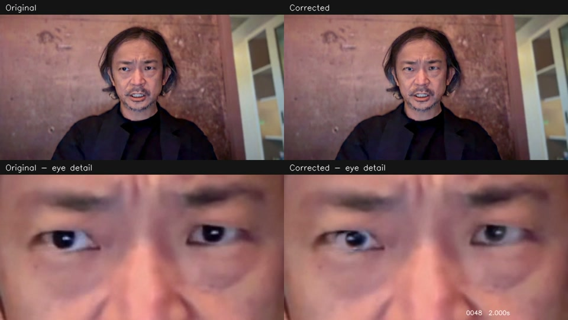

# 最新デモ：視線の揺れを抑えた版

2026-09-05。正面を見る目標位置と、素早い視線移動への追従を改善した版です。

| ファイル | 内容 |
| --- | --- |
| [steady-gaze-comparison.mp4](steady-gaze-comparison.mp4) | 左が元映像、右が補正後。下段は同じ時刻の目元拡大。 |
| [steady-gaze.mp4](steady-gaze.mp4) | 補正後の映像のみ。 |

両動画とも1280×720、24 fps、361フレーム、約15秒。個人キャリブレーションなし。全体の映像や音楽を新たに生成したものではなく、元映像の目元をローカル処理で補正し、元音声をそのままコピーしています。顔・目元の解析と、一部の目元の変形には学習済みモデルを使用しています。

前版より黒目の左右の画像上の位置変動が約83%減少しました。視線角度の正解との誤差を測った値ではありません。プレビュー画像は比較動画の2秒地点から取り出したものです。

[変更内容・検証結果・制限](../docs/steady-gaze.md) / [元動画](../Assets/test-video-2.mp4) / [解析表示付きの動画](../Assets/examples/video/steady-gaze/gaze-effect-steady-final-debug.mp4)

元の公開ファイルから場所と名前だけを変更しています。動画の内容は同一です。

- 補正動画のSHA-256: `a7c95d4917b4d4290ca5970691dd16d79c45540562e30a2711e5b474119a265b`
- 比較動画のSHA-256: `752eed8913eb51ae3b7a79cd6de0251ae034f9d9ce7ae5cc7c31425a966d82f6`
