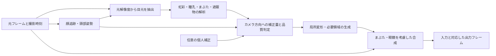

# Gaze Effect 精度改善戦略

2026-09-05。調査対象: `15992d3`。以下は当初の設計提案。後続の実装内容、生成動画、実測値と残る課題は[実装・検証の状況](implementation-status.md)に記載する。提案の存在だけで精度・速度を検証済みとは扱わない。

## 推奨方針

通常はキャリブレーションなしで使える構成にする。自動処理で目の形、照明、追跡の安定性に適応し、個人固有のカメラ目線のずれが残る場合だけ、短いレンズ注視で補正する。

解析、目標視線、画像の変形・補完、合成、時間方向の安定性を別々に評価する。虹彩の検出が正しくても、目標位置や合成マスクが誤っていれば自然なカメラ目線にはならない。

## 実装前に確認した制約（15992d3）

| 箇所 | 現在の実装 | 改善方針 |
| --- | --- | --- |
| 目標位置 | `GazeEffectCore.swift:190` は目の矩形中心と小さな縦補正を使用 | 頭部姿勢、眼球位置、カメラ方向から目標を求める。直接カメラ目線を生成するモデルも比較する |
| MediaPipe | `mediapipe-eye-landmarks.py:165` は連番画像を `detect()` で個別解析。顔姿勢行列・表情係数は未出力 | 元時刻付きの VIDEO 処理を評価し、必要な3D情報と開閉情報を保持する |
| 虹彩情報 | 虹彩の5点を平均し、単一の `pupil` 座標として保存 | 虹彩中心・輪郭と瞳孔中心を区別し、形状と可視範囲も保存する |
| 品質情報 | sidecar の `confidence` は一律 `0.95`。`faceBounds` は両目の点群の範囲 | 実測した目ごとの品質指標を導入し、顔領域と目領域の意味を修正する |
| 暗部による補正 | 拡張した目元の暗い連結領域から中心を選ぶ。眼球の意味的なマスクは使わない | まつ毛・眼鏡を除外し、虹彩境界と整合する場合だけ補正を採用する |
| ライブ表示 | フレーム画像と解析結果を別々に画面へ渡す。解析結果にフレームIDがない | 画像と結果を同じID・撮影時刻で結び、表示時の対応を保証する |
| 元の虹彩の消去 | 推定白目色、または近傍平均を48回反復して補完 | 白目の陰影・質感を残す変形を優先し、露出した不足領域だけ補完する |
| 虹彩の貼付 | `paintIrisPatch` は楕円と暗さで合成。貼付先のまぶたマスクを受け取らない | 眼球の可視領域でクリップし、まぶた・まつ毛・眼鏡の遮蔽順序を守る |
| プレビューとの差 | ライブはVisionとAppKit描画、オフラインは別の解析・合成実装 | 同じフレームと設定で比較できる共通の解析結果形式・レンダラーを使う |
| 比較動画 | GUIは12 fps抽出、36 fps出力、JPEG中間、H.264 CRF 30 | 品質評価の既定を元fps・元解像度・等速・高品質にする |

実ファイル確認: 元素材は1280×720、24 fps、361映像フレーム、約15.07秒。既存4分割動画は960×540、36 fps、181フレーム、約5.03秒。元映像と4分割動画の抽出フレームも目視したが、これだけでちらつきや一般的な精度は評価できない。

## 1. 解析を改善する

顔全体の検出は低解像度でも、目元の詳細解析には元解像度から切り出した画像を使う。目頭・目尻を基準に回転とスケールを正規化し、元フレームへ戻す変換を記録する。単なる拡大で元映像にない細部が測れるとは扱わない。

必要な出力は、左右の虹彩中心・輪郭、可能なら瞳孔輪郭、上下まぶた、白目、反射、遮蔽物、頭部姿勢、開閉状態。MediaPipeの出力を初期値にし、眼球領域内の輪郭フィットや目元専用モデルを比較する。瞳孔と虹彩は同じ意味の測定値として混ぜない。

品質指標には、目の画素数、ぼけ、白飛び、虹彩の可視率、境界フィット残差、遮蔽、検出手法間の不一致を使う。顔の検出スコアを目の正確さの代用にしない。APIが目ごとの確率を返さない場合は、独自の品質スコアとして記録し、確率と呼ばない。

まばたき判定は、顔の傾きに左右される画像軸に沿った矩形比から、目の局所座標での開閉量へ移す。瞳孔が得られないフレームは「不明」を保持し、輪郭中心を測定値として補わない。

MediaPipeはVIDEO/LIVE_STREAMで追跡を利用できるが、モード変更だけで高速な眼球運動が正確になるとは限らない。内部平滑化による遅れも実映像で測る。[公式ガイド](https://developers.google.com/edge/mediapipe/solutions/vision/face_landmarker/python)

## 2. カメラ目線の目標を改善する

目の2D中心へ移す処理から、頭部姿勢を考慮した目標へ進める。幾何モデルでは、各眼球中心からカメラ光学中心へ向かう方向を目標にし、頭部座標で必要な回転を求めて画像へ投影する。左右の目は同じカメラを注視する制約で結ぶが、同じ2D移動量にはしない。

顔の3Dランドマークだけで精密な眼球中心や個人の視軸が得られるとは仮定しない。カメラ内部パラメータが取得できれば使用し、不明時の推定値は不確かさを伴う初期値とする。通常のカメラ目線化には画面上の注視点の推定は必須ではない。

虹彩追跡と視線推定は別の課題であり、Googleも虹彩追跡だけでは見ている場所を推定しないと説明している。[Google Research](https://research.google/blog/mediapipe-iris-real-time-iris-tracking-depth-estimation/)

幾何推定の誤差を避けられる可能性がある比較対象として、入力の目元から直接カメラ目線への変形を予測する方式も用意する。視線角度やカメラ・画面配置を入力せず、変位場と明るさ補正を予測する先行研究がある。採用の判断は本プロジェクトの素材で行う。[Eye Contact Correction using Deep Neural Networks](https://arxiv.org/abs/1906.05378)

## 3. 映像生成と合成を改善する

小さな補正では、元の虹彩・白目の質感を使う連続的な局所変形を第一候補にする。目頭・目尻・まぶたとの接点を制約し、白目だけが極端に伸びないようにする。3D眼球モデルは目標位置と変形の初期値に利用する。

大きな補正では、元映像で隠れていた白目や虹彩を出す必要がある。変形だけで再現できない部分には、視線変更専用の目元生成モデル、または小さな残差補完モデルを使う。頭の向き・目の開き・目標方向を条件にし、左右の整合性を保つ。汎用画像生成をフレームごとに独立適用すると品質を制御しにくいため、まずこの限定した構成を試す。

合成は「背景の眼球 → まぶた・まつ毛 → 前景の眼鏡」の順序を明示する。眼鏡の透明部分を含む反射は単純な二値マスクでは扱えないため、分離が不確かな場合は補正量を下げる。虹彩を移す際にハイライトまで機械的に同じ量だけ動かさず、照明・角膜反射との整合を評価する。

境界は可視眼球マスクで制限し、色・明るさは周囲の局所統計に合わせる。線形光での合成、正しいアルファ処理、元映像に合ったぼけ・粒状感を共通レンダラーに含める。

NVIDIA Maxineも目元領域に限定した視線推定・生成を採用しており、比較基準にできる。ただし公式モデルカードの実行環境はWindows/LinuxとNVIDIA GPUであり、Macアプリへの直接組み込みができる前提にはしない。Mac向け候補は重みの入手性、利用条件、Core ML等への変換、実機速度を別々に検証する。[公式モデルカード](https://build.nvidia.com/nvidia/eyecontact/modelcard)

RTGazeは研究候補だが、今回確認した公式リポジトリではREADMEのみで、実装・重みは確認できなかった。直近の実装計画の依存先にはしない。[公式リポジトリ](https://github.com/hengfei-wang/RTGaze)

## 4. 時間方向は、安定させる対象を分ける

- 瞳孔位置・サッカード・まばたき: 現在の観測を優先し、強い移動平均で遅らせない。
- 頭部姿勢・眼球サイズ・目の形: ゆっくり変化する成分として安定化する。
- マスク・露出・補完テクスチャ: 動きに合わせて位置を揃え、対応が確かな領域だけ時間方向に安定化する。
- 補正の強さ: 品質境界でオン・オフが連打されないようにする。ただし閉眼・追跡喪失では即座に元映像へ戻し、過去の開いた目を残さない。

ライブは撮影時刻とフレームIDで解析・合成を対応させる。遅延を上限付きにし、古い結果を無条件で新しい画像に適用しない。オフラインは前後フレームも使えるが、切り替わり・遮蔽・対応失敗では履歴を破棄する。

## 5. キャリブレーションの段階

| 段階 | 利用者の操作 | 調整するもの | 限界 |
| --- | --- | --- | --- |
| 既定の全自動 | なし | 汎用モデルで開始し、安定した元フレームから目の形・開閉・照明等に適応 | 個人固有のカメラ目線の基準を完全に観測できるとは限らない |
| 任意の簡易補正 | カメラのレンズを2〜3秒見る。長さは初期設計案 | 左右の基準ずれ、直接注視時の目元の外観 | 1姿勢だけでは大きな頭の回転や全視線範囲の誤差を補正できない |
| 詳細補正 | 必要な用途のみ、姿勢や既知の注視点を追加 | 姿勢依存の補正、任意方向への視線変更 | 画面の点を使うなら、カメラ・画面・目の位置関係も扱う必要がある |

簡易補正は秒数経過だけで完了させず、十分な数の明瞭な開眼フレームが集まったかで判定する。本人・カメラ・解像度・クロップ・眼鏡の変更に応じて適用可否を判断し、簡単にリセットできるようにする。特定の数値を保証する機能にはしない。

「頻繁に見ている方向＝カメラ目線」と自動設定しない。注視先を観測できない映像だけから正解ラベルを作ると、資料を見る癖を学習し得る。自動適応には補正後の生成画像ではなく元画像を使用する。

個人固有の眼球光軸と視軸の差を扱う研究もあり、個人補正を残す根拠になる。ただし視線計測の精度と、カメラ目線に見える映像の自然さは別々に評価する。[Kappa Angle Regression, CVPR Workshops 2023](https://openaccess.thecvf.com/content/CVPR2023W/GAZE/html/Jin_Kappa_Angle_Regression_With_Ocular_Counter-Rolling_Awareness_for_Gaze_Estimation_CVPRW_2023_paper.html)

## 6. 実装順と採用条件

| 順序 | 作業 | 次へ進むための確認 |
| --- | --- | --- |
| P0 | 等速・元解像度の比較、フレームIDと時刻、共通解析記録、既存方式の基準値を作る | 比較する画像と解析結果が同一フレーム。未処理・失敗フレームを含めて数えられる |
| P1 | 目元の精密解析、頭部姿勢、目ごとの品質、不明状態、貼付先のまぶたマスク | 輪郭・中心の誤差が改善。まばたきや遮蔽で余計な虹彩が現れない |
| P2 | 幾何を使った局所変形と、直接カメラ目線を予測する方式を比較 | 目線の自然さと質感が共に改善。顔の向きや本人の目の形を維持 |
| P3 | 大きな変更向けの限定生成・時間方向の補完 | 二重虹彩、ちらつき、左右不一致が減り、未見の人・照明でも改善 |
| P4 | 残る個人差に任意の簡易補正を追加 | 未使用映像で個人補正の効果があり、他の姿勢で悪化しない |
| P5 | 共通レンダラーのMac最適化、ライブでの検証 | 実機で処理時間、撮影から出力までの遅延、欠落フレームを測る |

P1でマスク修正を先行しつつ、P2の目標計算を検証する。モデルの高度化だけを先に進めず、同じ解析結果で合成方式を比較できるようにする。

評価用素材には、レンズ注視、上下左右への素早い視線移動、頭部の回転、自然なまばたき、細目、眼鏡反射、暗所、顔の出入りを含める。開発中の閾値調整用と、最終評価用の人物・録画を分離する。

測定する項目:

- 解析: 人手で確認した虹彩中心・まぶた輪郭との差。画素誤差と目幅で正規化した誤差を併記する。
- 視線: 正解方向が分かる素材での角度誤差。補正映像では独立した推定器を補助に使い、人によるカメラ目線の評価も行う。
- 合成: 二重虹彩、まぶたへのはみ出し、目形状・虹彩色の変化、境界の色差、ハイライトの不自然さ。
- 時間: 動きを位置合わせした後のちらつき、まばたきのタイミング、補正の切替回数。素早い正当な目の動きをちらつきと混同しない。
- 運用: 補正した割合、通過させた割合と理由、処理時間の中央値・95パーセンタイル、撮影から出力までの遅延、フレーム欠落。

通過フレームを増やすだけで高品質に見せないよう、自然さと補正率を併記する。改善目標の数値は基準測定後に定める。

## 戦略作成時の確認範囲

`swift run GazeEffectCoreCheck` は実行して成功した。現在の4チェックは移動方向、移動量の制限、閉眼時の抑制、顔の低信頼時の抑制を確認するもので、実映像の視線精度や合成品質の保証ではない。

戦略作成時点ではコード読解、既存チェック、映像の形式確認と抽出フレームの目視、一次資料の確認まで実施した。後続の解析・生成・キャリブレーションの実装と検証は、上記の実装状況を参照。
